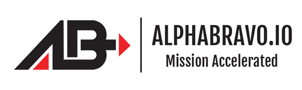

# AB's Default Dotfiles

## What's installed?

* Script: install-omz.sh - Installs Oh-My-ZSH and the Spaceship theme.
* Script: sync.sh - Syncs all of the dotfiles to your local machine.
* .aliases file for aliases.
* .gitconfig file for git configuration.
* .vimrc file for VIM configuration.
* .zshrc file for use with Oh-My-ZSH and Spaceship.
* Brewfile for Homebrew installation.

## Installation
Run the install.sh script from inside the dotfiles folder. 

* `cd ab-dotfiles/`
* `chmod +x install.sh`
* `./install.sh`

## WARNING
Do not run the executables from outside the dotfile folder. Doing so may have unintended consequences.

## Credits

Thanks to our Principal Engineer Ed Engelking for putting this together.

## About Alphabravo

**AlphaBravo** Provide products and services for Cloud and DevSecOps.

Contact **AB** today to learn how we can help you.

* **Web:** https://alphabravo.io
* **Email:** info@alphabravo.io
* **Phone:** 301-337-8141